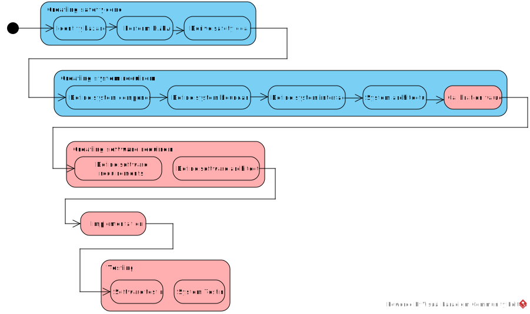

**Welcome back, readers of Arek’s Dev Diary!**

Today, I'm thrilled to introduce a project that I've been diligently working on: designing and implementing a comprehensive safety system for home automation. This safety system, which I fondly refer to as the 'Safety Component', is inspired by principles from the *ISO 26262* standard.

*ISO 26262*, for the uninitiated, is an international standard for functional safety tailored specifically to electrical and/or electronic systems in production automobiles. Although our home automation project isn't strictly adhering to this standard, the principles and guidelines it provides form a robust foundation for ensuring safety in any embedded systems. 

A key objective of this project is to develop and share robust Safety Components with the Home Assistant community, thereby contributing to the safety and reliability of home automation systems everywhere.

## Why ISO26262?
My choice of ISO 26262 as a source of inspiration for this project is a reflection of my professional experience as an embedded software engineer in the automotive industry. The standard serves as an excellent benchmark for safety, reliability, and efficiency, which are critical considerations in home automation as well.

The focus of our safety-oriented journey is the development of the Safety Component, an integral part of the overall home automation system. This component continuously monitors the status and health of various sensors and actuators. It detects, notifies, and sometimes even mitigates potential system issues, thereby enhancing the reliability of the system.

## Roadmap
Here's what you can expect from this journey. Blue parts are general, not coupled with specific home automation system or house. Red one shall be created for particular solution.

- Performing Hazard and Risk Analysis (HARA) to identify potential hazards and safety goals, ensuring risks are mitigated to an acceptable level.
- Creating system requirements and system architecture that define the components addressing the defined safety goals.
- Designing software architecture and requirements that implement the system's logic.
- Implementing the Safety Component according to the requirements and architecture.
- Performing software testing to ensure functional correctness and safety.
- Conducting system testing to validate the overall performance and safety of the system.

## Inspired by *ASPICE* and *ISO21434*
In addition to *ISO 26262*, our roadmap is also inspired by Automotive SPICE (ASPICE), a framework for successful project management, and *ISO21434*, a standard for cybersecurity in automotive systems. This combination of standards offers a comprehensive approach to safety and security in our home automation system. By integrating principles from these standards, I aim to significantly enhance the reliability and quality of my own home automation system.

## Continual Improvement
This project is not only a journey towards safer and more reliable home automation but also a process of continual improvement for my professional skills. Even though we're not strictly following *ISO 26262*, *ASPICE*, or *ISO21434*, the principles derived from these standards are beneficial for the project and my professional development.

## Waiting for feedback
Feel free to reach out via social media or email, and join this exciting journey into the world of home automation safety. Your inputs, questions, and suggestions are always welcome.

Stay tuned for upcoming blog posts where we'll delve into each stage of this journey in detail. We'll discuss the design and functionalities of the Safety Component, share insights from our home automation journey, and explore the many ways we can enhance the safety and reliability of home automation systems.